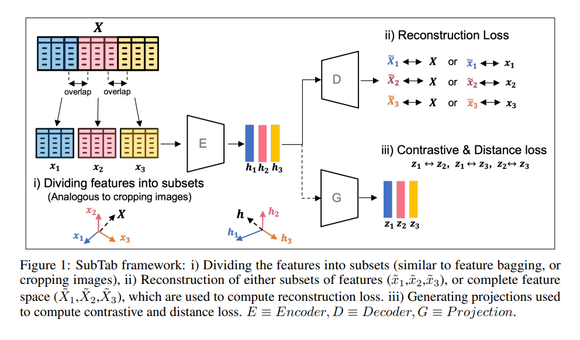
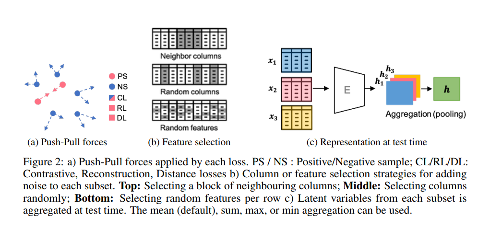
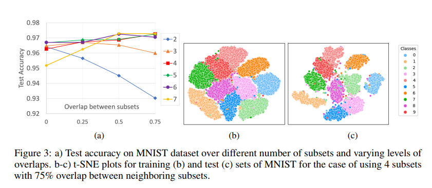
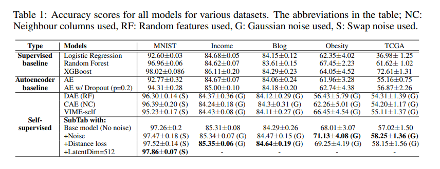
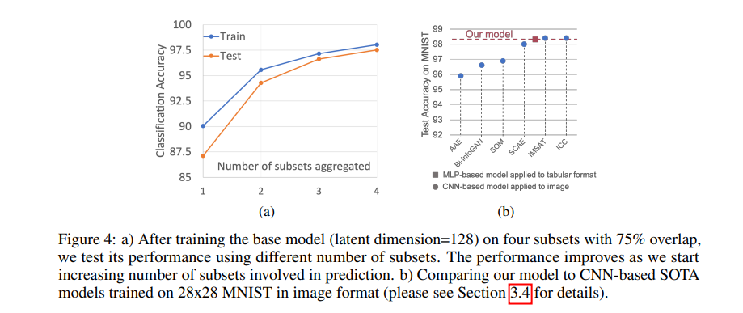
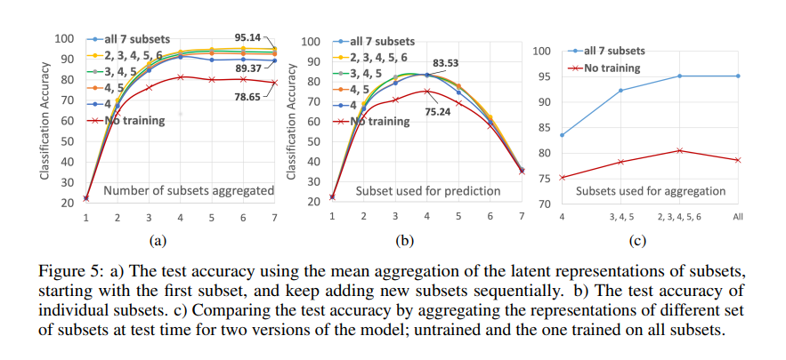
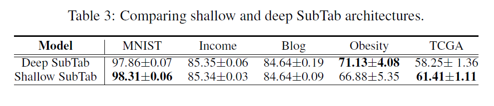

# Subtab: Subsetting Features of Tabular Data for Self-Supervised Representation Learning

## Abstract
- 表形式データには、空間的、時間的、意味的な構造がないことが場合があり、効果的なaugmentaion設計手法を設計するの難しく、表形式データでの有効な表現学習(事前学習)の進歩の妨げになっている
- 表形式データから学習するタスクをマルチビュー表現学習問題に変換する新しいフレームワーク、SubTab（Subsetting features of Tabular data）を提案する
  - マルチビュー表現学習：異なるビューからの複数のデータ情報を統合して学習パフォーマンスを向上させることが目的の学習
  - 入力された特徴を複数のサブセットに分割することで、表形式データからの学習タスクを多視点表現学習問題に変える
- オートエンコーダの設定において、破損したバージョンではなく、その特徴のサブセットからデータを再構成することで、その根底にある潜在的な表現をよりよく捕らえることができると主張

## 1. Introduction
#### 従来のアプローチ
- 表形式データでは、データにノイズを加えて、データを破損させることがもっとも一般的なアプローチ
  - オートエンコーダは、破損したデータ(ノイズを加えたデータ)を入力として、潜在的な空間にマッピングして、破損していないデータを復元する
  - この方法はすべての特徴が同じ情報を持っているかのように扱われるので、あまり効果的と言えない
  - また、情報量の少ない特徴にノイズを加えても、意図した破損の目的に至らない可能性もある
- 高次元データに対して不均衡なバイナリマスクを利用して分類器を学習させることは、意味のある表現学習をするには理想的ではない
#### 今回の研究
- Abstractで示したように問題を転換し、特徴量のサブセットからデータを再構築することで、エンコーダがノイズを加えるなどの既存の手法で学習した表現よりも優れた表現を学習できる
  - サブセットを表現を集約することで、より良い表現を構築する
  - 各サブセットの予測力を測定することで、有益な特徴の領域を発見する
  - 欠落した特徴がある場合、対応するサブセットを無視することで学習と推論を行う

## 2. Method

$E:Encoder,D:Decoder,G:optionalProjection$
$h$:(latent)representation, $z$:projection, $\tilde{x}$:the reconstruction of subset, $\tilde{X}$:the reconstruction of the whole data

$E\rightarrow D$
- 表形式のデータを複数のサブセットに分割する
  - サブセット間で重複部分があってもいい
- すべてのサブセットは同じエンコーダに入力する
- デコーダは、サブセットや全体集合を再構築する
  - 今回の実験では、エンコーダに入力されたサブセットから全体の集合を再構築する(reconstruction loss)
- オートエンコーダーはアイデンティティを学習できないため、ボトルネック（すなわち表現）の次元に関する制約がなくなることに留意する必要がある(??)

$E\rightarrow G$
- contrastive loss: すべてのサブセットからのprojectionのペアを利用して、contrastive lossを求める(対照学習)
- distance loss: MSE(平均二乗誤差)のような損失関数を用いて、サブセットのprejectionのペアの間の距離を縮める
$\quad$
- 2(a)が示しているのは、reconstruction lossとdistance lossはpositiveを近づける力を持っているが、contrastive lossはpositiveを近づけ、negativeを遠ざける力を持つということ。

## 2.1 Strategies for adding noise (optional)
- データセットをサブセットに分割するとその位置は固定される
  - 標準的なニューラルネットワークアーキテクチャは順列不変ではないため、学習中にサブセット内の特徴の相対的な順序を変更することはしない
    - これは、ニューラルネットワークの同じ入力ユニットには同じ特徴が与えられることを保証するためである
- しかし、本手法は次のステップとして順列不変の設定に拡張することが可能である
#### ノイズの加え方
- N(0,$\sigma^2$)に従うGaussian noise
- 任意の入力値を同じ列からランダム選ばれた別の値で置き換える(swap-noise)
- ランダムに選ばれた入力値を0にする(zero-out noise)
#### ノイズを加える特徴の選び方
- 隣接する列のランダムブロック(NC)(図2(b)上)
- ランダムな列(RC)(図2(b)中)
- 各サンプルごとのランダムな特徴量(RF)(図2(b)下)
$\quad$
- 以上に述べたノイズを実現するために、バイナリマスク$m$とサブセットと同じ形状のノイズ行列$\epsilon$を作成する
- マスクの入力は確率pで1に割り当てられ、それ以外は0となる
- サブセット$x_1$にノイズを加えた$x_{1c}$は以下のようになる
$$x_{1c}=(1-m)\odot x_1 + m \odot \epsilon $$

## 2.2 Traning
- 目的関数は以下の通り
$$\mathcal{L_t=L_r+L_c+L_d}$$
#### Reconstruction loss
- $(X,\tilde{X_k})$のペアを用いて、平均二乗誤差を計算して、k番目のサブセットのReconstruction lossを求める
$$\mathcal{L_r}=\frac{1}{K}\sum_{k=1}^Ks_k$$
$$s_k=\frac{1}{N}\sum_{i=1}^N{(X^{(i)}-\tilde{X_k}^{(i)})}^2$$
$K$:サブセットの総数、$N$:バッチサイズ、$s_k$:k番目のサブセットのReconstruction loss、$\mathcal{L_r}$:全サブセットのReconstrucsion lossの平均

#### Contrastive loss (optional)
- 2つのサブセットの同じ行にあるサンプル$z_1$と$z_2$を利用する
- 3つの部分集合$\{x_1,x_2,x_3\}$について、集合$S=\{\{z_1,z_2\},\{z_1,z_3\},\{z_2,z_3\}\}$から全3組のペア$\{z_a,z_b\}$について損失を計算する
$$\mathcal{L_c}=\frac{1}{J}\sum_{\{z_a,z_b\}\in S}p(z_a,z_b)$$
$$p(z_a,z_b)=\frac{1}{2N}\sum_{i=1}^N[l(z_a^{(i)},z_b^{(i)})+l(z_b^{(i)},z_a^{(i)})]$$
$$l(z_a^{(i)},z_b^{(i)})=-\rm{log}\frac{exp(\it{sim}(z_a^{(i)},z_b^{(i)}/\tau))}{\sum_{k=1}^{N}\mathbb{I}_{k\not =i}exp(\it{sim}z_a^{(i)},z_b^{(i)}/\tau)}$$
$J$:集合S内のペアの総数、$p(z_a,z_b)$:projection$\{z_a,z_b\}$のペアのContractive lossの合計、$l(z_a^{(i)},z_b^{(i)})$:$\{z_a,z_b\}$の対応する要素$(z_a^{(i)},z_b^{(i)})$の損失関数、$\mathcal{L_c}$:全サブセットのContrastive lossの平均、$\mathbb{I}$:単位行列
#### Distance loss (optional)
- サブセット内の対応する要素は近いはずなので、サブセットのprojectionのペア$(z_a^{(i)},z_b^{(i)})$の平均二乗誤差を用いて、Distance lossを求める
$$\mathcal{L_d}=\frac{1}{J}\sum_{\{z_a,z_b\}\in S}p(z_a,z_b)$$
$$p(z_a,z_b)=\frac{1}{N}\sum_{i=1}^N{(z_a^{(i)}-z_b^{(i)})}^2$$
$\mathcal{L_d}$:Distance loss

## 2.3 Test time
- テスト時は、テストデータをサブセットに分割して、エンコーダに入力して、特徴抽出する(図2(c))
- エンコーダの出力をすべて使わなくても(h1のみ、h1,h2の2つなど)、良い性能を達成した
  - 欠損のあるデータでも学習できる
- サブセット間で情報量に違いがある場合、サブセットの表現の加重平均を計算するaggregation functionを定義する
$$h=\frac{1}{Z}\sum_{k=1}^{K}\eta_k*h_k$$
$$Z=\sum_{k=1}^{K}\eta_k$$
$K$:サブセットの数、$\eta_k$:k番目のサブセットの重み
$\quad$
- テスト時に特に記載がない場合、$\eta_k=1$である。
- 学習時にサブセットの表現をseparete channelsとして扱うことで、上の式で1次元畳み込みを使用可能(今後の研究課題)

## 3. Experiments
#### 比較対象
- autoencoder baseline
- self-supervised
  - VINE-self, Denoising Autoencoder(DAE),Content Encoder(CAE) 
- fully-supervised
  - logistic regression, randam forest, XGBoost
#### 実験
- 各データセットにおいて、一度特定のオートエンコーダのアーキテクチャを決定すると、比較したすべてのモデルにそれを使用した
- 活性化関数はReLUとleakyReLU
  - どっちもいい結果
  
## 3.1 Data
- MNIST in tabular format
- the cancer genome atlas
- human gut mestagen-omic samples of obesity cohorts
- UCI adult income
- UCI BlogFeedback

## 3.2 Evaluation
- 訓練集合とテスト集合の両方について、サブセットの埋め込み(エンコード後)の平均値を集約したものを用いて、結合潜在表現(元の全体集合)を求める
  - $\mathcal{L_r}$を使う

## 3.3 Result
#### MNIST in tabular format
- ベースモデル([512,256,128]の単純な3層エンコーダアーキテクチャ)の学習
  - $\mathcal{L_r,L_c}$、ノイズなし(ⅰ)
  - $\mathcal{L_r,L_c}$、ノイズあり(ⅱ)
  - $\mathcal{L_r,L_c,L_d}$、ノイズあり(ⅲ)
  - $\mathcal{L_r,L_c,L_d}$、ノイズあり、最終層128→512(ⅳ)

- 条件ⅰでサブセット数と重複割合を変えてみた(図3a)
- サブセット4、重複度75%のときのt-SNE plots(図3b:training,c:test)

- サブセット4、重複度75%のときのⅰ,ⅱ,ⅲ,ⅳの結果
  - ノイズはswap-noiseを使用(一番性能が良かったから)

- 追加実験Ⅰ
  - サブセット4、重複度75%の条件で、再構築に用いるサブセット数を変えて実験(図4a)

- 追加実験Ⅱ(重複度0)
  - (学習中に)情報量が欠けていても大丈夫だということを示す(図5a)
  - 特徴量はどこが多いのか(図5b)
- 追加実験Ⅲ
  - (テスト時に)情報量がかけていても大丈夫 
    - でも、モデルが多いほど予測精度が高い(図5c)
$\quad$
- 追加実験全体を通して、以下のようなことがわかる
  - 情報量が少ないサブセットはなくてもいいが、あると少しは性能が上がり、少なくとも邪魔にはなっていない(図5c)
  - 未訓練モデルを使用して、どのサブセットの情報量が多いかわかる(図5b)
  - どのサブセットで学習しても、性能は変わらない(図5b)
    - 図5bの横軸を見るとわかる
  - 欠損したサブセットがあっても大丈夫
#### the cancer genome atlas(表1)
- ベースモデル([1024,784,784]の単純な3層エンコーダアーキテクチャ)
- sub-tab、サブセット4、重複度75％、Gaussian noise($\sigma=0.1$)
#### human gut mestagen-omic samples of obesity cohorts(表1)
- ベースモデル([1024,1024]の単純な2層エンコーダアーキテクチャ)
- sub-tab、サブセット6、重複度0％、Gaussian noise($\sigma=0.3$)
#### UCI adult income,BlogFeedback(表1)
- ベースモデル([1024,1024]の単純な2層エンコーダアーキテクチャ)、reconstruction loss($\mathcal{L_c}$)のみ
- sub-tab、サブセット5(7)、重複度25%(75％)、Gaussian noise、distance loss($\mathcal{L_d}$)を追加すると性能向上
  - ()内はBlog、()外はincome

## 3.4 Ablation study

- reconstruction lossのみでよい性能を発揮
  - 元のデータのサブセットを再構築すること自体が、非常に有効な表現学習手法である
- データ集約を行わないと精度が下がる(表2の最後の2行)

## 4. Related works
- VIME
  - 非常に高次元で、小さく、ノイズの多いデータセットでは、モデルがオーバーパラメータになりやすく、過学習を起こしやすい
  - 非常に高次元で、疎で、アンバランスなマスクを予測する必要があるので、分類器学習が困難になる可能性がある
- TabNet、TaBERTなど
  - 破損したデータから元データを復元する手法

## 5. Conclusion

- 表形式のMNISTで学習したMLPベースのシンプルなオートエンコーダーが、教師なし／自己教師ありのフレームワークでMNIST画像で学習したCNNベースのSOTAモデルと同等のパフォーマンスを発揮できる
- SabTabの肝は2つ
  - 特徴のサブセットから全体の特徴を再構築すること
  - サブセットのembeddingsをaggregatingすること(表現学習)
- 特徴の部分集合を用いることで、学習時のデータインピュテーションの必要性をなくし、テスト時に特徴の部分集合を用いた推論を可能にする
- 異なる特徴量の部分集合を同時に用いてモデルを学習することができるため、高次元データの分散学習への扉を開くことができるかもしれない
- 共通の特徴を持つ異なるデータセットに対して、その特徴を同じ部分集合に割り当てることで活用できる可能性もある（転移学習）
- 対比損失や距離損失を用いると、投影の組み合わせが必要となり、学習時の計算量が2次関数となり、データを分割するために使用できるサブセットの数が制限される
  - テスト時には部分集合の表現の総和を計算するだけでよいので、計算量は線形

## 6. Broader Impact
- 表形式データは、医療、金融、法律、その他多くの分野で一般的に使用されている形式
- 表形式データから得られる人口統計学やゲノム学などの知識を、画像やテキスト、音声などのデータと組み合わせることで、転移学習や分散学習、マルチビュー学習などの他の分野にも広く応用できる可能性